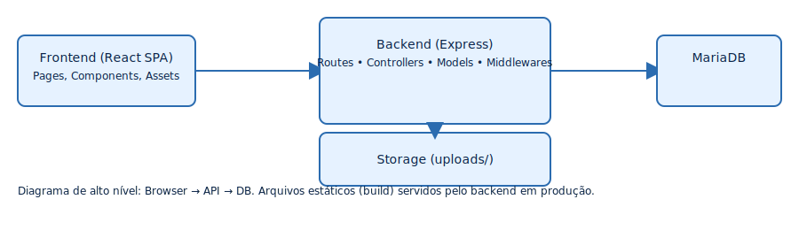
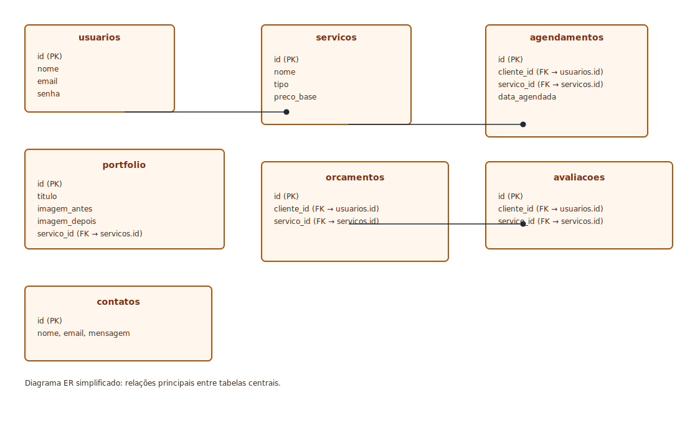

<!-- Combined technical overview for Word export: includes backend + frontend sections and embeds diagram images -->

# Visão Técnica Consolidada — Site de Películas

_Este documento foi preparado para exportação para Word (.docx). Ele incorpora os diagramas gerados em `backend/docs/assets` e `frontend/docs/assets`._

---

## Sumário
- Visão geral
- Diagrama de alto nível
- Backend (camadas e modelos)
- Banco de dados (ER)
- Frontend (componentes e integração)
- Fluxo de autenticação
- Como rodar localmente
- Lacunas e próximos passos

---

## Visão geral

Projeto dividido em duas partes: `frontend/` (React SPA) e `backend/` (API Node + MariaDB). O frontend consome endpoints do backend e pode enviar uploads (portfolio). O backend expõe autenticação e modelos para serviços, agendamentos, orçamentos e avaliações.

---

## Diagrama de alto nível

---

## Backend — resumo das camadas

- `src/server.js`: entrypoint do Express.
- `src/config/database.js`: pool MariaDB.
- `src/models`: queries SQL diretas (Usuario, Servico, Agendamento).
- `src/controllers`: lógica de negócio (ex.: `authController.js`).
- `src/routes`: rotas montadas (ex.: `routes/auth.js`).

---

## Banco de dados (ER simplificado)

---

## Frontend — componentes e fluxo

- Local: `frontend/src` (App, pages, components, services/api).
- Integrations: consome `/api/auth`, `/api/servicos`, `/api/agendamentos`.

---

## Fluxo de autenticação

Sequência: usuário faz login no frontend → frontend POST /api/auth/login → backend valida e retorna JWT → frontend armazena token e adiciona header Authorization para requests protegidos.

---

## Como gerar o arquivo Word (.docx)

Veja `backend/docs/WORD_INSTRUCTIONS.md` para instruções detalhadas (Pandoc + referência de estilo Word). Recomendado: gerar `.docx` via Pandoc usando um `reference.docx` com a fonte desejada.

---

## Lacunas conhecidas e próximos passos

- Implementar rotas REST faltantes (servicos, agendamentos, portfolio, orcamentos, avaliacoes, contatos).
- Criar scripts SQL/migration para automatizar criação do schema.
- Implementar upload seguro e validações (multer + express-validator).
- Adicionar testes automatizados.
