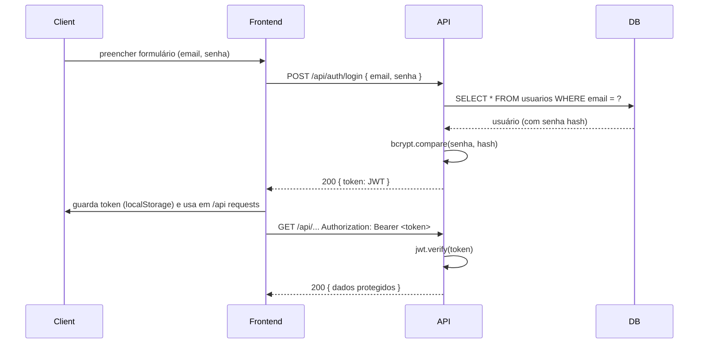

## Visão técnica do projeto: Site de Películas (predial e automotivo)

Este documento descreve a arquitetura, componentes, fluxos principais e o modelo de dados do projeto localizado em `c:\Users\olima\Desktop\SITE`.

:::
Observação: o repositório contém duas partes principais: `frontend/` (React) e `backend/` (API Node + MariaDB).
:::

## Sumário
- Visão geral
- Diagrama de alto nível (Mermaid)
- Frontend (o que faz)
- Backend (camadas, rotas e models existentes)
- Banco de dados (ER diagram simplificado)
- Fluxo de autenticação (sequência)
- Como rodar localmente (notas rápidas)
- Lacunas conhecidas e próximos passos

---

## Visão geral

Objetivo: fornecer uma API para gerenciamento de serviços, agendamentos, orçamentos e portfolio de trabalhos para uma empresa de aplicação de películas.

- Frontend: SPA em React (pasta `frontend/src`) — páginas públicas, formulário de contato, visualização de serviços e portfolio.
- Backend: Node.js + Express (pasta `backend/src`) — modelos que usam `mariadb` para acessar o MariaDB.
- Banco de dados: modelado em `backend/docs/database.md` (tabelas: `usuarios`, `servicos`, `agendamentos`, `portfolio`, `orcamentos`, `avaliacoes`, `contatos`).

---

## Diagrama de alto nível

Componente Mermaid (copie e cole em um visualizador Mermaid para renderizar):

```mermaid
flowchart LR
  A[Frontend (React)] -->|HTTP/HTTPS| B[API (Express) /backend/src]
  B --> C[(MariaDB)]
  B --> D[Storage (uploads/ local) - imagens portfolio]
  subgraph Frontend
    A1[Pages / Components]
  end
  subgraph Backend
    B1[Routes]
    B2[Controllers]
    B3[Models (SQL queries)]
    B4[Middlewares]
  end
  B --> B1
  B1 --> B2
  B2 --> B3
  B2 --> B4
```

Descrição rápida:
- O `frontend` consome endpoints HTTP expostos pelo `backend` (ex.: `/api/auth`, futura `/api/servicos`, `/api/agendamentos`).
- O `backend` executa queries via `mariadb` (pool em `src/config/database.js`) e grava arquivos de upload em `uploads/`.

---

## Frontend (resumo)

- Localização: `frontend/src`
- Páginas principais já existentes: `home`, `services`, `portfolio`, `contact`.
- Responsabilidade: UI, chamadas para API, formulários, exibição de portfolio/serviços.

Observação: o frontend build já existe em `frontend/build` — provavelmente o site está preparado para deploy estático junto com o backend em rotas públicas.

---

## Backend (resumo das camadas e arquivos importantes)

- Entrada do servidor: `backend/src/server.js` — cria app Express e monta rotas.
- Configuração DB: `backend/src/config/database.js` — cria pool `mariadb.createPool`.
- Models existentes (queries SQL diretas):
  - `backend/src/models/Usuario.js` — criar usuário, buscar por email, listar (observação: agora faz hash de senha).
  - `backend/src/models/Servico.js` — criar/listar/buscarPorId (filtra `ativo = true`).
  - `backend/src/models/Agendamento.js` — criar, listarPorCliente, atualizarStatus.
- Rotas/Controllers implementados recentemente:
  - `backend/src/controllers/authController.js` — `register` e `login` (gera JWT).
  - `backend/src/routes/auth.js` — monta `POST /api/auth/register` e `POST /api/auth/login`.
  - `backend/src/middlewares/authMiddleware.js` — middleware para verificar JWT.

Estado atual: modelos básicos estão implementados, mas não existe uma camada completa de controllers/rotas para todos os recursos (ex.: `servicos`, `agendamentos` expostos ainda não via rotas REST completas). Pastas `controllers/` e `routes/` têm espaço para mais arquivos.

---

## Banco de dados (ER - diagrama simplificado)

Use este diagrama Mermaid para visualizar as principais tabelas definidas em `backend/docs/database.md`:

```mermaid
erDiagram
    USUARIOS {
        INT id PK
        VARCHAR nome
        VARCHAR email UNIQUE
        VARCHAR senha
        ENUM tipo
        VARCHAR telefone
        TIMESTAMP criado_em
    }
    SERVICOS {
        INT id PK
        VARCHAR nome
        TEXT descricao
        ENUM tipo
        DECIMAL preco_base
        VARCHAR tempo_estimado
        BOOLEAN ativo
        TIMESTAMP criado_em
    }
    AGENDAMENTOS {
        INT id PK
        INT cliente_id FK
        INT servico_id FK
        DATETIME data_agendada
        ENUM status
        TEXT observacoes
        DECIMAL valor_total
        TIMESTAMP criado_em
    }
    PORTFOLIO {
        INT id PK
        VARCHAR titulo
        TEXT descricao
        ENUM tipo
        VARCHAR imagem_antes
        VARCHAR imagem_depois
        INT servico_id FK
        DATE data_realizacao
        TIMESTAMP criado_em
    }
    ORCAMENTOS {
        INT id PK
        INT cliente_id FK
        INT servico_id FK
        DECIMAL area_aproximada
        VARCHAR tipo_imovel
        VARCHAR tipo_veiculo
        ENUM status
        DECIMAL valor_estimado
        DATE validade_orcamento
        TEXT observacoes
        TIMESTAMP criado_em
    }
    AVALIACOES {
        INT id PK
        INT cliente_id FK
        INT servico_id FK
        INT agendamento_id FK
        INT nota
        TEXT comentario
        TIMESTAMP criado_em
    }
    CONTATOS {
        INT id PK
        VARCHAR nome
        VARCHAR email
        VARCHAR telefone
        TEXT mensagem
        ENUM status
        TIMESTAMP criado_em
    }

    USUARIOS ||--o{ AGENDAMENTOS : cliente
    SERVICOS ||--o{ AGENDAMENTOS : servico
    SERVICOS ||--o{ PORTFOLIO : servico
    USUARIOS ||--o{ ORCAMENTOS : cliente
    SERVICOS ||--o{ ORCAMENTOS : servico
    USUARIOS ||--o{ AVALIACOES : cliente
    SERVICOS ||--o{ AVALIACOES : servico
    AGENDAMENTOS ||--o{ AVALIACOES : agendamento
```

Observação: as constraints (FKs) e enums estão descritas no arquivo `backend/docs/database.md`.

---

## Fluxo de autenticação (sequência)

Sequência simplificada (Mermaid):



---

## Endpoints existentes e previstos

Implementados (próximos passos e localização):
- POST `/api/auth/register` — `backend/src/routes/auth.js` -> `authController.register`
- POST `/api/auth/login` — `backend/src/routes/auth.js` -> `authController.login`

Previstos / a implementar:
- CRUD `servicos` (GET /api/servicos, POST /api/servicos, GET /api/servicos/:id, PUT, DELETE)
- CRUD `agendamentos` (POST /api/agendamentos, GET /api/agendamentos/:id, listar por cliente)
- Endpoints para `portfolio` com upload de imagens
- Endpoints para `orcamentos`, `avaliacoes`, `contatos`

---

## Como rodar localmente — notas rápidas

1. Backend:

```powershell
cd c:\Users\olima\Desktop\SITE\backend
npm install
# configurar .env com DB_HOST, DB_USER, DB_PASSWORD, DB_NAME e JWT_SECRET
npm run dev
```

2. Frontend (desenvolvimento):

```powershell
cd c:\Users\olima\Desktop\SITE\frontend
npm install
npm start
```

Observação: se usar o build estático em `frontend/build`, sirva os arquivos com um servidor estático (ou configurar o backend para servir arquivos estáticos do build).

---

## Lacunas conhecidas (priorizadas)

1. Falta de rotas REST completas e controllers para `servicos`, `agendamentos`, `portfolio`, `orcamentos`, `avaliacoes`, `contatos`.
2. Falta de scripts SQL/migration para criar o schema automaticamente (existe `backend/docs/database.md` com o DDL, mas não há `scripts/init-db.sql`).
3. Falta de upload seguro para imagens (p.ex. `multer`) e limpeza/validação de arquivos.
4. Validação de entrada (usar `express-validator`) e tratamento centralizado de erros.
5. Testes automatizados (unit/integration) — atualmente inexistentes.

---

## Próximos passos sugeridos (curto prazo)

- Implementar endpoints REST para `servicos` e `agendamentos` (prioridade alta).
- Gerar script `scripts/init-db.sql` com os CREATE TABLE do `database.md`.
- Adicionar `multer` e endpoints para `portfolio` (upload de imagens) e salvar caminhos em DB.
- Implementar validação (`express-validator`) e middlewares de tratamento de erros.
- Adicionar testes básicos com `jest` + `supertest` para autenticação e modelos.

---

## Contato / referências

- Arquivo com DDL e justificativas: `backend/docs/database.md`.
- Config DB pool: `backend/src/config/database.js`.
- Modelos: `backend/src/models/*.js`.

Se quiser, eu já posso:
- (A) Gerar `scripts/init-db.sql` a partir do `database.md` e adicioná-lo em `backend/scripts`.
- (B) Implementar rotas CRUD para `servicos` e `agendamentos` e testes básicos.

Indique qual opção prefere e eu faço o próximo commit.
