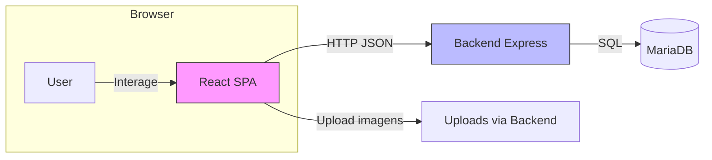
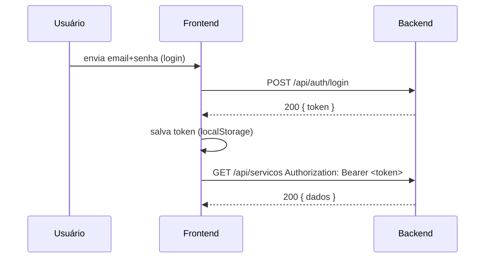

# Visão técnica do Frontend — Site de Películas

Este documento apresenta a arquitetura, componentes principais, fluxos de dados e instruções rápidas para o frontend localizado em `frontend/` do projeto.

## Sumário
- Visão geral
- Estrutura de pastas e responsabilidades
- Diagrama de alto nível (Mermaid)
- Componentes e páginas importantes
- Serviços/integração com a API (endpoints esperados)
- Fluxo de autenticação (sequência)
- Como rodar / build / deploy rápido
- Lacunas conhecidas e próximos passos

---

## Visão geral

O frontend é uma SPA React (Create React App ou similar). Tem páginas públicas para mostrar serviços, portfolio e um formulário de contato. O bundle de produção já existe em `frontend/build`.

Objetivo: oferecer interface para clientes visualizarem serviços, solicitar agendamentos e entrar em contato; consumir a API do backend (ex.: `/api/auth`, `/api/servicos`, `/api/agendamentos`).

---

## Estrutura de pastas (resumida)

- `src/` — código fonte React
  - `src/index.js` — bootstrap da aplicação
  - `src/App.js` — roteamento principal
  - `src/pages/` — páginas por rota (home, contact, portfolio, services)
  - `src/components/` — componentes reutilizáveis (`layout/Header.js`, `layout/Footer.js`, `sections/*`)
  - `src/services/api/` — funções HTTP para consumir a API (fetch/axios)
  - `src/assets/` — imagens, ícones, vídeos
  - `src/styles/` — temas e estilos globais

Build produzido por: `npm run build` (provavelmente usando CRA). Pastas já presentes: `build/` e `public/` com arquivos estáticos.

---

## Diagrama de alto nível (Mermaid)

Cole este bloco em um visualizador Mermaid para renderizar:



---

## Componentes e páginas importantes

- `Header` / `Footer` — layout global
- `Home` — hero, benefícios e chamadas para ação
- `Services` — lista os serviços (consome `/api/servicos`), filtros por tipo (`predial`/`automotivo`)
- `Portfolio` — galeria de trabalhos (poderá consumir `/api/portfolio`)
- `Contact` — formulário que envia para `/api/contatos`
- `TestPage` — página de testes presente no repositório

Cada seção principal (ex.: `Services.js`, `Portfolio.js`) deve usar `src/services/api/*` para centralizar chamadas HTTP e tratamento de erros.

---

## Serviços / integração com API (endpoints esperados)

Observando o backend (arquivo `backend/docs/database.md` e rotas iniciadas), o frontend deverá consumir os seguintes endpoints (alguns já implementados no backend):

- Autenticação
  - POST `/api/auth/register` — cria usuário
  - POST `/api/auth/login` — obtém JWT

- Serviços
  - GET `/api/servicos` — lista de serviços (filtrar por tipo)
  - GET `/api/servicos/:id` — detalhes do serviço
  - POST `/api/servicos` — (admin) criar serviço

- Agendamentos
  - POST `/api/agendamentos` — criar agendamento (requer autenticação)
  - GET `/api/agendamentos?cliente_id=` — listar por cliente
  - PUT `/api/agendamentos/:id/status` — atualizar status (admin)

- Portfolio
  - GET `/api/portfolio` — listar projetos
  - POST `/api/portfolio` — (admin) criar entrada com upload de imagens

- Contatos / Orçamentos / Avaliações
  - POST `/api/contatos` — enviar mensagem de contato
  - POST `/api/orcamentos` — criar pedido de orçamento
  - POST `/api/avaliacoes` — enviar avaliação

Observação: rotas de `servicos`, `agendamentos`, `portfolio` ainda precisam ser implementadas no backend; o frontend deve tratar erros/graceful fallback quando endpoints não existirem.

---

## Fluxo de autenticação (sequência)

Diagrama simplificado:



Implementação no frontend:
- armazenar token com segurança mínima (localStorage) e adicionar header `Authorization: Bearer <token>` nas chamadas protegidas.
- ideal: renovar token / logout / expirations.

---

## Como rodar / build / deploy (rápido)

1) Instalar dependências e rodar em dev:

```powershell
cd c:\Users\olima\Desktop\SITE\frontend
npm install
npm start
```

2) Gerar build de produção:

```powershell
npm run build
# arquivos finais em frontend\build
```

3) Servir build com backend (opcional): copie `frontend/build` para servidor estático ou configure o Express para servir `build` como estático.

---

## Lacunas conhecidas (frontend) e melhorias sugeridas

1. Centralizar chamadas HTTP via `src/services/api` (se não existir) e tratar token/refresh.
2. Implementar tratamento de erros e feedback UX (toasts / loaders) para chamadas API.
3. Proteção de rotas (ex.: área do cliente) via contexto ou HOC que verifica token. Criar `AuthContext` para expor `user` e `logout`.
4. Upload de imagens com pré-visualização e validação (tamanho/tipo).
5. Testes de componentes e E2E (Jest + React Testing Library / Cypress).

---

## Próximos passos recomendados

- Criar/organizar `src/services/api/*` com funções: `auth.js`, `servicos.js`, `agendamentos.js`, `portfolio.js`.
- Implementar `AuthContext` e proteção de rotas.
- Integrar componentes com endpoints reais do backend quando estiverem disponíveis.

Se quiser, eu já posso:
- (A) Gerar o arquivo `src/services/api/auth.js` e um `AuthContext` mínimo para armazenar token e fornecer `login`/`logout` à aplicação.
- (B) Implementar chamadas de listagem para `Services` usando `fetch`/`axios` apontando para `/api/servicos`.

Indique a opção desejada e eu implemento no próximo passo.
